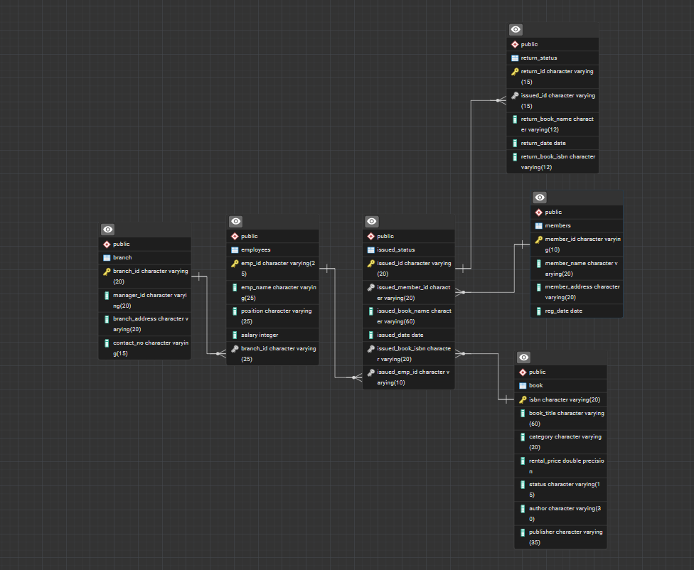

# Library Database Design & Analytics (PostgreSQL)
 
A structured SQL project focused on designing a relational database for a library domain using PostgreSQL. The project covers schema design, constraints, data validation, and analytical queries on a realistic multi-table dataset.

It demonstrates how operational data is modeled and prepared for reporting and analysis in real-world analytics workflows.

## Project Overview

Domain: Library operations
Database: PostgreSQL
Tables: 6 (books, members, loans, etc.)
Focus: schema design, constraints, joins, analytical queries

It includes creating and managing tables, performing CRUD operations, defining relationships, and executing analytical queries.
The goal is to showcase skills in database design, data manipulation, and query optimization aligning with professional data engineering and analytics practices.

## Features:

- Multi-table relational schema (books, members, employees, branches, issues, returns)
- Primary and foreign key constraints
- Sample data for testing and analysis
- CRUD operations
- Derived tables using CTAS
- Analytical queries for business-style questions
- Reporting views
- Data quality validation (nulls, duplicates, integrity checks)
- Schema migration script  

## Project Visualization

  
   <em>System Overview – Digital Library Management Architecture</em>

### Database ER Diagram

  
   <em>Database Schema – Entity-Relationship Diagram for Library System</em>

### Concept Visualization

  
   <em>Real-World Context – Physical Library Environment Representation</em>

A library environment where members borrow and return books, managed through an efficient, data-driven system.

## Project Structure    

000_migration_from_original_to_final.sql -- Schema migration   
001_create_tables.sql -- Table definitions  
002_add_constraints.sql -- Primary & foreign keys    
003_seed_data.sql -- Sample data insertion    
004_sample_queries.sql -- CRUD & analytical queries  
005_views_and_reports.sql -- Reporting views  
006_data_quality_checks.sql -- Data validation queries  

## How to Run:

1. Create the database:  
CREATE DATABASE library_management_system;  
2. Run SQL files in this order:  
    1_create_tables.sql  
    2_add_constraints.sql  
    3_seed_data.sql  
    4_sample_queries.sql  
    5_views_and_reports.sql  
    6_data_quality_checks.sql  

If upgrading from an older schema:  
   0_migration_from_original_to_final.sql  

3.Verify:  
\dt   -- list tables  
\dv   -- list views  

## Skills Demonstrated:

- Relational database design (normalized schema)  
- Primary & foreign key constraints  
- CRUD operations and analytical SQL queries  
- Aggregations and business-style reporting  
- Data quality checks (nulls, duplicates, consistency)  
- Basic indexing for join performance  

## Tools Used  
• PostgreSQL  
• pgAdmin  
• VS Code  
• Git & GitHub  
• Excel (basic validation/exploration)  

## Example Use Cases  
•	Track book issues, returns, and overdue status  
•	Monitor branch performance and employee workloads  
•	Identify expensive books or popular categories  
•	Generate category-wise revenue and utilization reports  

## Possible Extensions  

- Add triggers to maintain audit columns automatically        
- Create stored procedures for issue/return workflows      
- Build dashboards using Power BI or Tableau on top of SQL views      

## Author
Yadnyesh Thakare  
LinkedIn: linkedin.com/in/yadnyesh-thakare  
Email: thakareyadnyesh@gmail.com  

## Summary:

This project follows a modular SQL workflow covering schema design, constraints, data loading, CRUD operations, analytical querying, reporting, data validation, and schema migration.  

It demonstrates practical SQL and relational database skills aligned with real-world enterprise workflows.  

